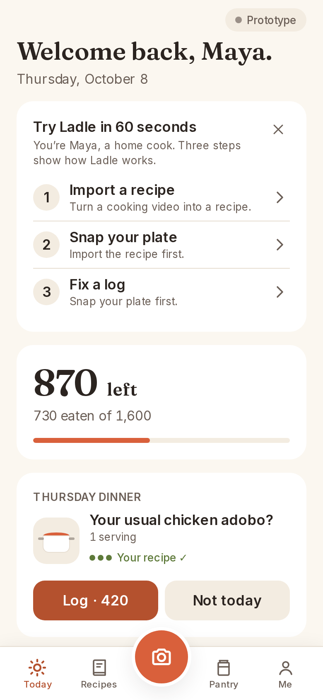
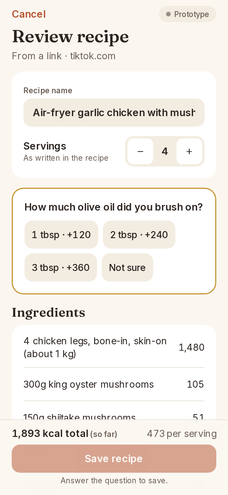
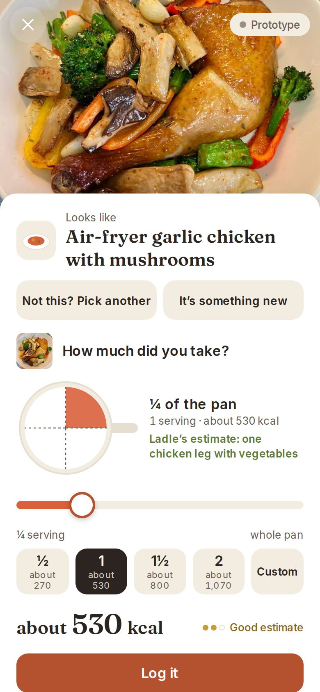
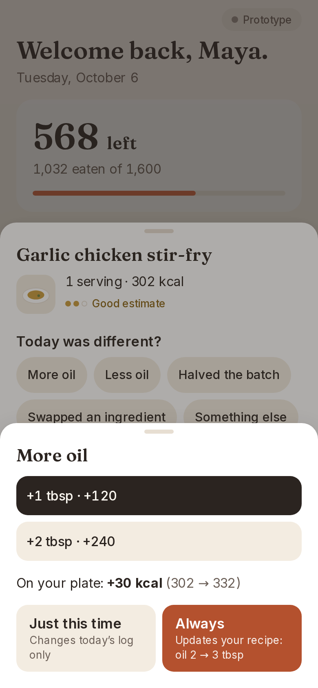
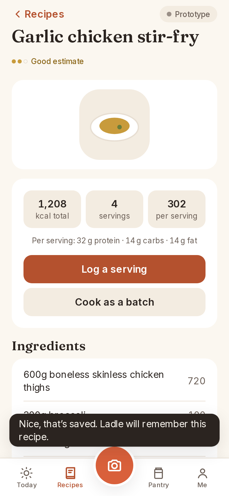
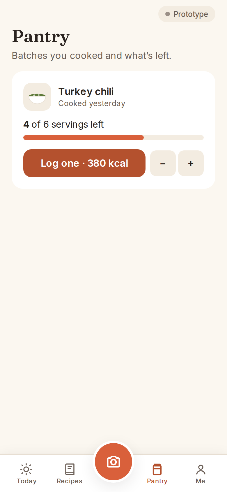
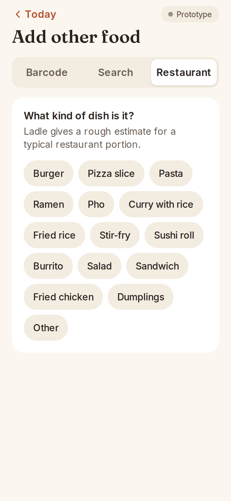
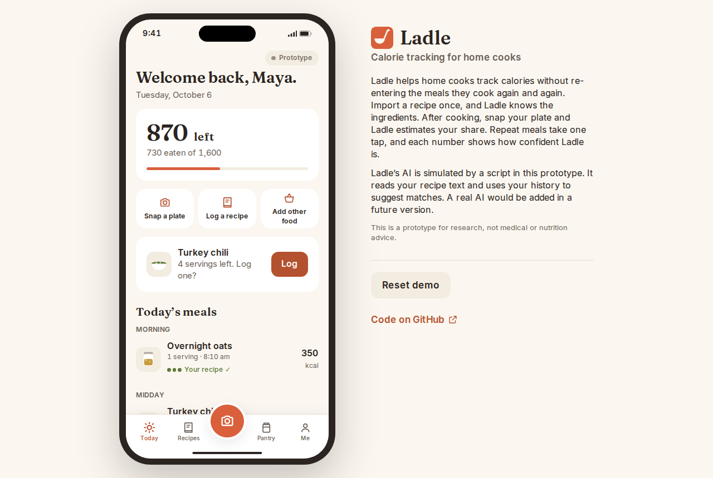

# Ladle

**A calorie tracker for home cooks.** A UX case study prototype by Ran Guo.

> The recipe knows the ingredients; the photo only measures your share.

**Live prototype:** https://ladle-prototype.vercel.app (works on a phone or a laptop; no sign-up)

This is a prototype for research, not medical or nutrition advice.

## What Ladle is

Most calorie trackers make home cooks re-enter the same meals again and again.
Ladle flips that: you import a recipe once (from a link, a caption or a photo of
a recipe card), Ladle works out its ingredients and calories, and after cooking
you snap your plate. Ladle suggests which recipe it is and how much of it is on
your plate. Repeat meals take one tap, leftovers from a big pot count down, and
every number shows how sure Ladle is: **Rough estimate**, **Good estimate**,
**Your recipe ✓** or **From the label**.

You start as Maya, a home cook with six saved recipes and two meals logged today.
A **Try Ladle in 60 seconds** card on Today walks through the core loop in three
steps (import a recipe, snap your plate, fix a log). It's part of the page, not a
pop-up: close it with ×, and bring it back from **Me → About this prototype →
Show the 60-second tour**.

## How sure Ladle is

Every calorie number has a label:

- **Your recipe ✓**: you've confirmed your portion of this recipe at least 3 times,
  so this number is as good as your recipe.
- **Good estimate**: from your recipe, but your portion hasn't been confirmed 3
  times yet (or typical values for a snack or drink).
- **Rough estimate**: from a photo or a restaurant dish type, without a recipe.
- **From the label**: from a packaged food's nutrition label.

A portion counts as confirmed when you choose it: from the plate photo result, the
portion helper, the portion picker, or by changing a meal's portion. Quick logs
(the one-tap **Log · 420** buttons, the "Your usual" card, leftovers) don't count.
Estimates are shown rounded to the nearest 10 with "about" (for example
"Log · about 530"); recipe totals and the daily budget stay exact.

On Today, **Your usual** suggests the likely meal for now (for example "Thursday
dinner · Your usual chicken adobo?"), from your history, the weekday, the time of
day and what you cooked recently. "Not today" shows the next idea, up to three.

Quick fixes say where a change happens ("+1 tbsp in the pan · +120 for the batch")
and lead with what it means for you: "On your plate: +30 kcal". Only one sheet is
ever open at a time; deeper steps happen inside it.

## Screenshots

| Today | Import a recipe | Plate photo | Quick fix |
| --- | --- | --- | --- |
|  |  |  |  |

| Recipe card | Pantry | Add other food | On a laptop |
| --- | --- | --- | --- |
|  |  |  |  |

## Usability test tasks

The prototype supports these five tasks for moderated sessions:

1. You found this air-fryer chicken video and want to cook it tonight. Add it to
   Ladle (Recipes → Add recipe → Use demo link). The demo recipe is "Air-fryer
   garlic chicken with mushrooms" (serves 4): 1,893 kcal before oil, and Ladle
   asks how much olive oil you brushed on (2 tbsp → 2,133 kcal, about 533 a serving).
2. You just made the air-fryer chicken. Log what's on your plate (Camera → Use
   sample photo).
3. You brushed on extra oil again, like you always do. Fix today's log.
4. It's Thursday and you're having your usual adobo. Log it.
5. Add your grandmother's braised pork from her recipe card (Add recipe → Photo → Use example card).

Visitors can also bring their own recipes, links and photos. With your own plate
photo, a portion helper shows the pan divided into servings: slide to show how
much you took (in quarter servings), and the portion chips follow.

The demo link is `https://www.tiktok.com/@homecook/video/demo-airfryer-garlic-chicken`.
The older link (`…/demo-garlic-chicken`) still works and opens the same recipe.

## The AI in this prototype is simulated

Ladle doesn't call a real AI. A script that runs in your browser plays that part,
so the prototype is free, needs no API key and works for every visitor. It is
built to behave the way a real assistant would, and it is honest about its limits:
a **Prototype** pill on every screen explains this.

- **Recipes (link, pasted text, photo).** Ladle reads each ingredient line, works
  out the amount and unit (fractions, ranges, "T" for tablespoon and "t" for
  teaspoon), and looks the ingredient up in a built-in table of about 200 common
  ingredients from ten cuisines (approximate USDA FoodData Central values).
  Vague amounts that change the calories a lot ("oil for frying", "a drizzle of
  olive oil") become up to three questions. Lines it can't match are kept and
  marked "Check this line".
- **Recipe websites.** Ladle's server fetches the page (public `https://` pages
  only, 8 seconds, 2 MB) and reads the recipe data most sites include
  (schema.org Recipe). Without it, Ladle takes the page's list items and asks you
  to check them. Video links ask for the caption instead.
- **Recipe photos.** Text recognition ([Tesseract.js](https://github.com/naptha/tesseract.js))
  runs on your device. If it can't read the photo well, you can fix the text.
- **Plate photos.** Ladle can't see food. It suggests the recipe you most likely
  made, using what you cooked or opened recently, what you usually eat on this
  day and at this time, and a light colour hint from the photo. The photo only
  measures your share. The same photo and history always give the same answer.
- **Corrections, snacks and restaurant meals.** "Added 30g cheddar" or "no rice"
  is worked out from the same table. Food search covers about 120 snacks, drinks
  and dishes. Restaurant meals use a typical range for the kind of dish and are
  always marked as rough estimates.

Packaged food isn't simulated: a barcode is looked up in the free
[Open Food Facts](https://world.openfoodfacts.org) database, and label data
always beats an estimate.

The bundled demo examples (the demo video link, its caption, Grandma's recipe
card and the sample plate photo) always give the same scripted answers, so
usability-test tasks behave identically for every participant.

All of this sits behind one interface (`lib/ai/types.ts`), so a real AI can be
added later without changing the screens. This version has no real AI, so there
are no access codes or API keys to manage.

## Privacy

Ladle runs in your browser and your data stays on this device. Recipe links are
fetched by Ladle's server to read the ingredients, and barcode lookups go to Open
Food Facts. Nothing is stored on a server. Plate photos are deleted once the meal
is logged. **Me → Export my data** saves everything as a file, and **Delete all
data** removes it.

## Resetting the demo

- **Me → Reset demo** brings back Maya's starting data (the panel beside the
  phone on a laptop has the same button).
- **Me → Delete all data** empties Ladle completely.

### Test controls (for usability sessions)

On the **Me** tab, press and hold the version line ("Ladle prototype · v1.0").
Hidden controls open:

- **Reset to test start:** Maya's starting data, and the timer back to zero. Use
  it between participants.
- **Show task timer:** a small stopwatch to start, pause and reset.
- **Show the next test task:** which of T1–T5 the participant hasn't done yet.
- **Simulate an AI error on the next request**, **Hide the Prototype pill**,
  **Hide the 60-second tour**, **Treat today as Thursday** (Maya's usual Thursday
  adobo comes first, for T4 on any day) and **Make batches 5 days older** (to see
  "Still have it?").

### Running a recorded test session

1. On the Me tab, press and hold "Ladle prototype · v1.0" to open Test controls.
2. Type a participant ID (for example P01) and tap **Start a session**. Ladle goes
   back to Maya's starting data, hides the Prototype pill and the tour, and treats
   today as Thursday. Tell the participant the AI is simulated.
3. A dark test bar appears at the top of the phone screen. Read the task aloud,
   then tap **T1** to start timing it. The task ends by itself when it's done (for
   T1, when the air-fryer chicken is saved), or tap **End task** to stop it.
   Taps on the test bar never count.
4. Repeat for T2–T5 (tap ↕ to move the bar if it covers something).
5. Tap **End** to finish. The summary shows each task's time, taps and wrong
   turns, with ✓ or ✗ against its target: T1 saved in under 2 minutes, T2 in 3 taps
   or fewer, T3 a one-step fix with a choice made, T4 under 10 seconds with the
   estimate unchanged, T5 saved. Add a note per task, then **Save as CSV**.
6. Past sessions stay in Test controls: open one, **Save all as one CSV**, or
   **Delete session**.

What's recorded for each task: start and end time, duration, taps inside the app,
edits (changes to what Ladle filled in), wrong turns (Back, Cancel, closing a sheet,
or switching to a tab that doesn't help with the task), whether it was completed,
whether the estimate was accepted (T2 and T4), and the choice made (the oil answer
for T1, the portion chosen against the suggestion for T2, Just this time or Always
for T3, how T4 was logged). The CSV columns are `participant, date, task,
started_at, ended_at, duration_s, taps, edits, wrong_turns, completed,
accepted_estimate, choice_details, target_met, moderator_note`.

Sessions are kept in this browser only. They aren't part of **Export my data**,
Reset doesn't touch them, and only **Delete session** or **Delete all data**
removes them.

## Running it on your own computer

You need [Node.js](https://nodejs.org) 20 or newer.

```bash
npm install
npm run dev      # then open http://localhost:3000
npm test         # automatic checks for the simulated AI and the app's rules
npm run lint     # code style checks
npm run build    # the production build Vercel runs
```

Before `dev` and `build`, a small script copies the text-recognition files from
the installed packages into `public/tesseract` (they aren't stored in GitHub).

## Deploying

The live site is on [Vercel](https://vercel.com), connected to this GitHub
repository:

- Every push to `main` updates the public site automatically.
- Every other branch gets its own preview link, used to review a change before
  it goes public.
- No settings are required. One optional setting: `CASE_STUDY_URL` (Vercel →
  Project → Settings → Environment Variables) adds "Read the case study" links
  (in the side panel, Me → About this prototype, and the 60-second tour's last
  step). They stay hidden while it's empty. Redeploy after changing it.

## Quality

- Works on phones from 375 px wide and on laptops (the app sits in a phone
  frame beside an info panel). Light and dark themes follow the device setting.
- Built to WCAG 2.2 AA: readable contrast, labels for screen readers, visible
  keyboard focus, and reduced motion when the device asks for it.
- Lighthouse on mobile (local build): Performance 91–96, Accessibility 100,
  Best Practices 100.
- Security headers include a Content Security Policy. The two server routes
  (recipe pages and barcodes) accept only checked input and never reach private
  network addresses.

## Built with

Next.js, React, TypeScript and Tailwind CSS. Fonts: Fraunces and Inter. Zod checks
every AI answer, Vitest runs the tests, and Tesseract.js reads recipe photos.
The sample plate photo is Ran's own. The recipe card and illustrations were made
for this project.
